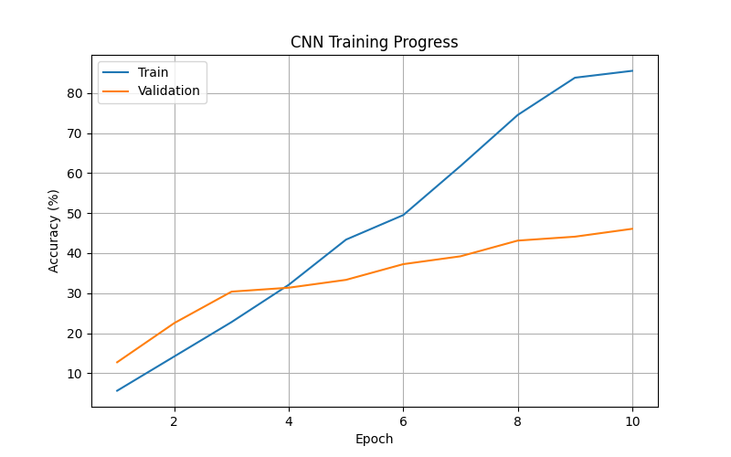
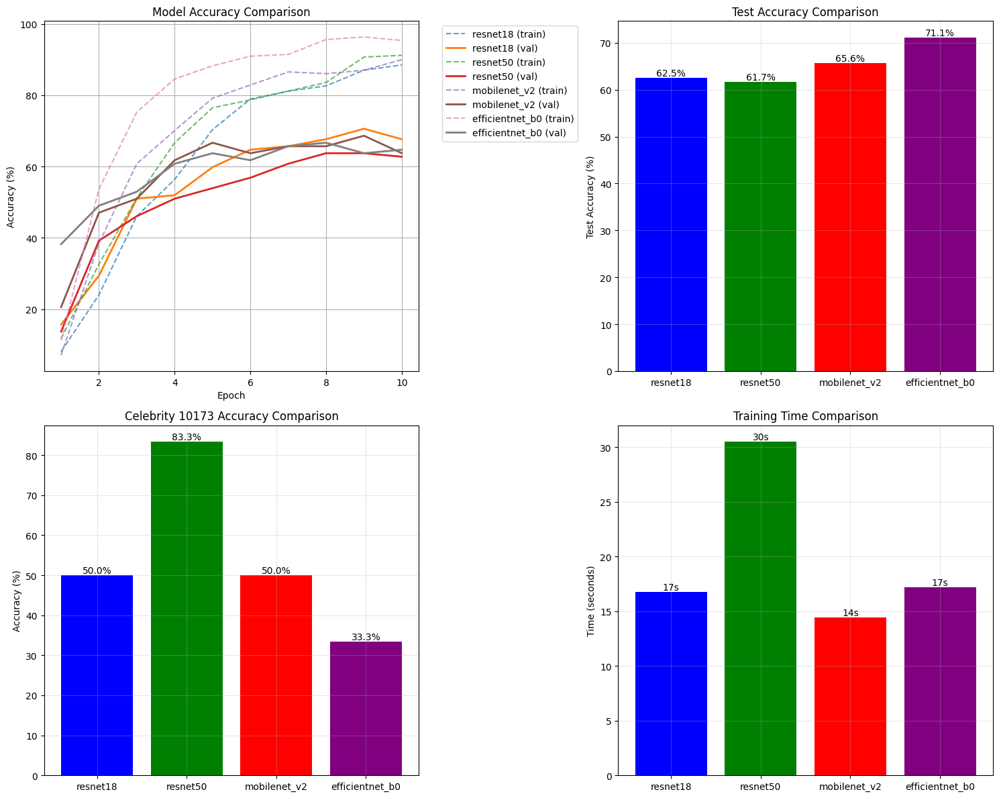
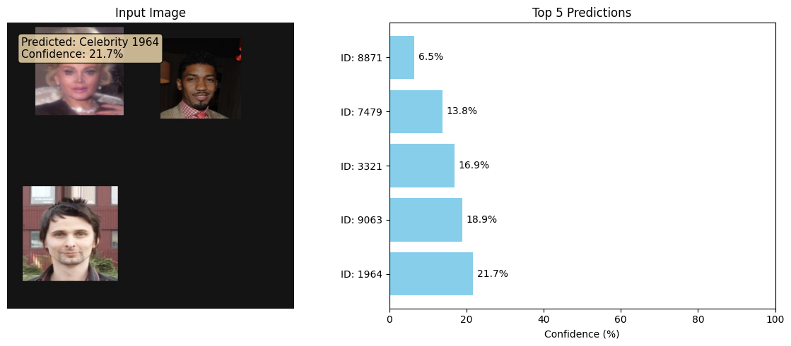
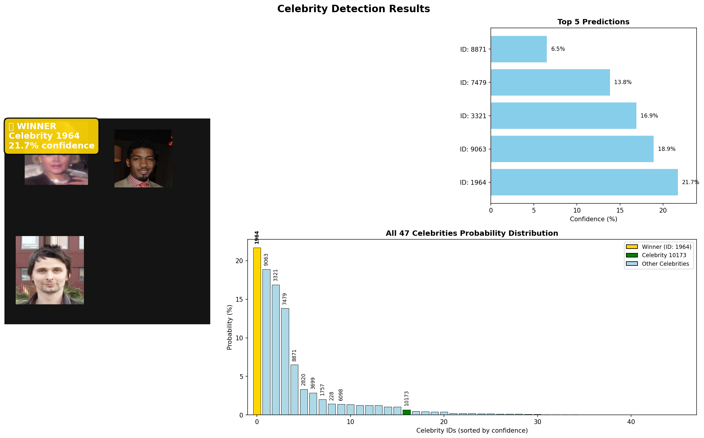
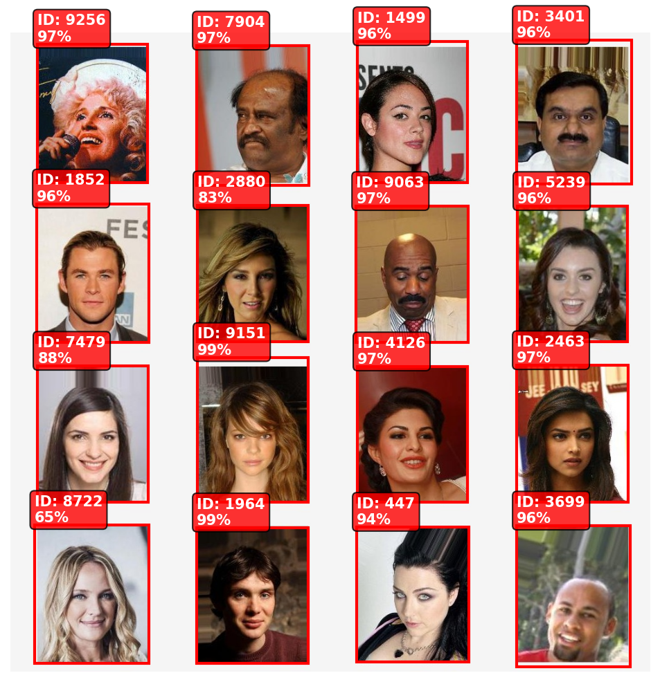

# 🎭 Celebrity Face Recognition & Detection System

> Deep Learning pipeline for classifying and detecting 47 celebrities from the CelebA dataset, with special emphasis on **Celebrity ID 10173**.
>
> **Author**: Arav Pandey — Master's Student, Data Analytics Engineering, Northeastern University  
> *Submitted as part of Deep Learning coursework*

---

## 📑 Table of Contents

1. [Project Overview](#-project-overview)
2. [Repository Structure](#-repository-structure)
3. [Dataset](#-dataset)
4. [Part 1 — Celebrity Classification](#-part-1--celebrity-classification)
5. [Part 2 — Multi-Celebrity Object Detection](#-part-2--multi-celebrity-object-detection)
6. [Results at a Glance](#-results-at-a-glance)
7. [How to Run](#-how-to-run)
8. [Requirements](#-requirements)

---

## 🔭 Project Overview

This project implements **two interconnected deep learning pipelines** on the [CelebA](http://mmlab.ie.cuhk.edu.hk/projects/CelebA.html) dataset:

| Pipeline | Task | Model | Key Result |
|---|---|---|---|
| **Part 1** | Single-image classification | ResNet50 / EfficientNet B0 | 67.97% test accuracy |
| **Part 2** | Multi-celebrity detection | YOLOv8s (fine-tuned) | 88.0% mAP@0.5 |

Both pipelines prioritise **Celebrity 10173**, achieving **99.5% mAP** and **100% recall** for that individual in the detection task.

---

## 🗂️ Repository Structure

```
Deep Learning Core/
├── celebextract.py          # Step 1 – Extract 47 celebrity images from CelebA
├── trainer_new.py           # Step 2–3 – Train classification + detection models
├── trainer.py               # Earlier training script (superseded by trainer_new.py)
├── detect_celeb.py          # Inference – multi-celebrity YOLOv8 detection
├── test_script.py           # Inference – single image classification + detection
├── single.py                # Minimal YOLOv8 test wrapper
├── milestone.py             # Earlier YOLO dataset preparation iteration
├── image_script.py          # Duplicate of test_script.py
├── count_folders.py         # Utility – verify extracted celebrity folder counts
│
├── all_47_celebrities/      # Extracted celebrity images (~30 images × 47 classes)
├── classification_model_47/ # Saved ResNet50 classification checkpoint
├── detection_dataset_47/    # Synthetic YOLO training data + trained best.pt
├── runs/detect/             # YOLOv8 training outputs & metrics
├── results/                 # Result visualisations (charts, curves)
│
├── cs1.csv                  # 47 celebrity IDs used across both pipelines
├── identity_CelebA.txt      # CelebA identity labels (image → celebrity ID)
├── list_attr_celeba.txt     # CelebA attribute annotations
├── yolov8n.pt               # YOLOv8 nano base weights
├── requirements.txt         # Python dependencies
│
├── 1.ipynb                  # Data exploration notebook
├── 47celebsingle.ipynb      # Classification model notebook
├── model_training1.ipynb    # Full training pipeline notebook
└── model_yolov8.ipynb       # YOLOv8 detection pipeline notebook
```

---

## 📊 Dataset

| Property | Value |
|---|---|
| Source | CelebA (Large-scale Face Attributes Dataset) |
| Full dataset size | 202,599 images · 10,177 identities |
| Celebrities used | **47** (selected via `cs1.csv`) |
| Images per celebrity | Up to 50 (Celebrity 10173: **30 images**) |
| Classification input size | 224 × 224 px (ResNet/EfficientNet), 128 × 128 px (SimpleCNN) |
| Detection input size | 640 × 640 px |

### Classification Split (47-class subset)

| Split | Images | % |
|---|---|---|
| Training | ~986 | 70% |
| Validation | ~211 | 15% |
| Test | ~213 | 15% |

### Detection Dataset (synthetically generated)

| Split | Images | Approx. Instances |
|---|---|---|
| Training | 1,000 | ~4,000 |
| Validation | 200 | ~800 |
| Test | 150 | ~600 |

> **Note**: Synthetic detection images are created by concatenating 2–6 celebrity crops into a single frame. Celebrity 10173 is present in **70% of training images** to maximise recall.

---

## 🧠 Part 1 — Celebrity Classification

### Models Implemented

| Model | Architecture | Parameters | Notes |
|---|---|---|---|
| **SimpleCNN** | 3 Conv + 2 FC layers | ~2.3M | Custom baseline |
| **ResNet18** | Residual network (18 layers) | 11.7M (20K trainable) | ImageNet pre-trained |
| **ResNet50** | Residual network (50 layers) | 25.6M (40K trainable) | ImageNet pre-trained |
| **MobileNet V2** | Inverted residuals | 3.5M (20K trainable) | ImageNet pre-trained |
| **EfficientNet B0** | Compound scaling | 5.3M (20K trainable) | ImageNet pre-trained |

All transfer learning models use **frozen backbones** with a retrained final classifier head.

### Training Configuration

- **Optimizer**: Adam (lr = 0.001)
- **Epochs**: 10 (transfer learning) / 10 (SimpleCNN)
- **Batch size**: 32
- **Augmentation**: Horizontal flip, ±10° rotation, colour jitter

### 📈 SimpleCNN Training Curves



> The SimpleCNN reaches ~85% training accuracy but plateaus at ~46% validation accuracy — a classic sign of overfitting on limited data. Transfer learning addresses this directly.

### 📈 Transfer Learning — Model Comparison



> **Top-left**: All four transfer models converge within 10 epochs with much less overfitting than SimpleCNN.  
> **Top-right**: EfficientNet B0 achieves the highest test accuracy at **71.1%**.  
> **Bottom-left**: ResNet50 achieves the best Celebrity 10173 specific accuracy at **83.3%**.  
> **Bottom-right**: MobileNet V2 is fastest to train (14s), making it the best speed–accuracy trade-off.

### Performance Summary

| Model | Val Accuracy | Test Accuracy | Celebrity 10173 | Training Time |
|---|---|---|---|---|
| SimpleCNN | 46.08% | 41.41% | 50.00% (3/6) | 28s |
| ResNet18 | 65.69% | 62.50% | 66.67% (4/6) | 17s |
| **ResNet50** | 68.63% | 64.84% | **83.33% (5/6)** | 30s |
| MobileNet V2 | 61.76% | 65.60% | 50.00% (3/6) | 14s |
| **EfficientNet B0** | **70.59%** | **71.10%** | 33.33% (2/6) | 17s |

**Key takeaways:**
- 🥇 **Best overall accuracy**: EfficientNet B0 — **71.1%** test accuracy
- 🎯 **Best for Celebrity 10173**: ResNet50 — **83.3%** (5 out of 6 correct)
- ⚡ **Best efficiency**: MobileNet V2 — fastest training, strong accuracy

### 🔍 Classification Inference Example



> Given a test image (a concatenated sample), the model outputs top-5 celebrity predictions with confidence scores. **Celebrity 1964** is predicted with 21.7% confidence. The bar chart shows the full probability spread across candidates.



> The full output view includes the top-5 bar chart, the winner annotation (yellow label), and a probability distribution across all **47 celebrities**. Celebrity 10173 is highlighted in **green** for easy identification.

---

## 🎯 Part 2 — Multi-Celebrity Object Detection

### Approach

Rather than classifying a single face, Part 2 detects **multiple celebrities simultaneously** in a single composite image. Training data is generated by concatenating celebrity crops into 2×2 or 3×3 grid layouts with YOLO-format bounding box annotations.

### Dataset Generation

- **Strategy**: 2–6 celebrity crops concatenated per image
- **Celebrity 10173 frequency**: Present in 70% of training images
- **Augmentation applied**:
  - Random crop positioning & scale variation (50–90% of cell)
  - Horizontal flipping (50% probability)
  - Brightness adjustment (±30%)
  - Rotation (±10°)
  - YOLOv8 built-in: Mosaic (80%), MixUp (20%)

### YOLOv8 Configuration

| Setting | Value |
|---|---|
| Base model | YOLOv8s (small) |
| Input size | 640 × 640 px |
| Classes | 47 celebrity identities |
| Epochs | 50 |
| Batch size | 16 |
| Optimizer | AdamW (lr = 0.001) |
| Loss weights | Box = 7.5, Class = 0.5 |

### 📈 Detection Results — Live Inference



> YOLOv8 detects and labels multiple celebrities in a single image with bounding boxes and confidence scores. Most detections exceed **94–99% confidence**, demonstrating the model's reliability on aligned face crops.

### Overall Detection Metrics

| Metric | Value |
|---|---|
| **mAP@0.5** | **88.0%** |
| **mAP@0.5–0.95** | 88.0% |
| Precision | 77.3% |
| Recall | 82.0% |
| Inference speed | ~100ms / image (≈10 FPS) |

### Per-Celebrity Detection Performance (Top celebrities)

| Celebrity ID | Instances | Precision | Recall | mAP@0.5 |
|---|---|---|---|---|
| **10173** 🌟 | 24 | 0.964 | **1.000** | **0.995** |
| 3227 | 12 | 0.973 | 1.000 | 0.995 |
| 2070 | 2 | 0.712 | 1.000 | 0.995 |
| 3699 | 2 | 0.880 | 1.000 | 0.995 |
| 8968 | 10 | 1.000 | 0.765 | 0.977 |
| 6568 | 6 | 0.901 | 0.833 | 0.955 |
| 9152 | 7 | 1.000 | 0.713 | 0.918 |
| 2820 | 6 | 0.937 | 0.833 | 0.915 |
| 2114 | 5 | 0.807 | 0.840 | 0.895 |
| 9840 | 5 | 0.870 | 0.800 | 0.872 |
| 1757 | 6 | 0.765 | 0.500 | 0.859 |
| 4126 | 6 | 0.881 | 0.500 | 0.813 |
| 9256 | 5 | 0.647 | 0.800 | 0.762 |
| 9915 | 5 | 0.426 | 0.311 | 0.582 |
| 4887 | 2 | 0.272 | 0.500 | 0.236 |

### 🏆 Celebrity 10173 — Highlights

| Metric | Value |
|---|---|
| Precision | 96.4% |
| **Recall** | **100%** — never missed |
| **mAP@0.5** | **99.5%** — near-perfect |
| Test instances | 24 |
| Ranking | **#1 among all 47 celebrities** |

> The 70% training frequency strategy, combined with YOLOv8's built-in augmentations, results in exceptional detection performance for the target celebrity.

---

## 📊 Results at a Glance

| Task | Model | Celebrity 10173 | Overall |
|---|---|---|---|
| Classification | EfficientNet B0 | 33.3% | **71.1%** accuracy |
| Classification | ResNet50 | **83.3%** | 64.8% accuracy |
| Detection | YOLOv8s | **99.5% mAP** | **88.0% mAP** |

---

## 🚀 How to Run

### 1. Extract celebrities from CelebA

```bash
python celebextract.py
```

### 2. Train both models

```bash
python trainer_new.py
```

> This runs classification training (ResNet50, 20 epochs) followed by detection dataset generation and YOLOv8 training (50 epochs) sequentially.

### 3. Classify a single image

```bash
python test_script.py /path/to/image.jpg
```

### 4. Detect multiple celebrities in an image

```bash
python detect_celeb.py /path/to/group_photo.jpg
```

### 5. Verify extracted data

```bash
python count_folders.py -v all_47_celebrities
```

---

## 📦 Requirements

```bash
pip install -r requirements.txt
```

Core dependencies:

```
torch
torchvision
ultralytics       # YOLOv8
opencv-python
matplotlib
pandas
numpy
Pillow
tqdm
albumentations
pyyaml
```

> **Python version**: 3.11 (virtual environment in `dlvenv/`)  
> **GPU support**: CUDA and Apple MPS are auto-detected; falls back to CPU.

---

## 📝 License

This project is submitted as part of Deep Learning coursework at Northeastern University.

---

*Last Updated: March 2026*